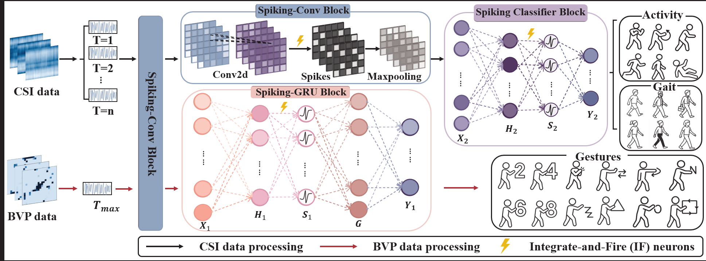

# SWS-Net

Official implementation of **Spiking-Aided Neural Architecture for Efficient and Robust WiFi Sensing**.

SWS-Net is a hybrid ANN-SNN architecture for device-free WiFi sensing. It combines spiking neurons with conventional neural modules to improve robustness to noisy indoor WiFi signals while keeping the model lightweight and efficient.

<p align="center">
  
</p>

## Highlights

- Supports three WiFi sensing tasks: activity recognition, human identification, and gesture recognition.
- Handles two WiFi signal formats: CSI and BVP.
- Provides unified training entries for CNN, CNNRes, LSTM, Transformer, SNN, and SNN-GRU baselines.
- Includes threshold and timestep ablations for spiking models.

## Repository Structure

```text
data/       Dataset loading and preprocessing
model/      Model definitions for BVP and CSI experiments
train/      Training and evaluation entry points
dataset/    Local datasets, ignored by git
assets/     README figures
```

## Datasets

Large datasets are not tracked by git. Place them under:

```text
dataset/
  BVP_22guesture_all/
  NTU-Fi_HAR/
  NTU-Fi-HumanID/
```

Download sources:

```text
NTU-Fi-HAR and NTU-Fi-HumanID:
https://drive.google.com/drive/mobile/folders/1R0R8SlVbLI1iUFQCzh_mH90H_4CW2iwt?usp=sharing

Widar 3.0:
https://tns.thss.tsinghua.edu.cn/widar3.0/
```

For NTU-Fi CSI experiments, keep the original split folders:

```text
dataset/NTU-Fi_HAR/
  train_amp/
  test_amp/
dataset/NTU-Fi-HumanID/
  train_amp/
  test_amp/
```

For BVP 22-gesture experiments, place the prepared `.mat` files under:

```text
dataset/BVP_22guesture_all/
```

## Installation

```bash
pip install -r requirements.txt
```

## Train on BVP

Run from the repository root:

```bash
python -m train.train_bvp --model cnn --data-root dataset/BVP_22guesture_all
```

Available BVP models:

```text
cnn
cnnres
lstm
snngru
transformer
```

SNN-GRU example:

```bash
python -m train.train_bvp --model snngru --data-root dataset/BVP_22guesture_all --epochs 50 --batch-size 32
```

BVP SNN-GRU threshold and timestep ablations:

```bash
# Full-time baseline, equivalent to K=None.
python -m train.train_bvp --model snngru --time-groups none --v-threshold 0.5

# Grouped-time comparison with K=4.
python -m train.train_bvp --model snngru --time-groups 4 --v-threshold 0.5

# Sweep thresholds.
python -m train.train_bvp --model snngru --time-groups none --v-thresholds 0.25,0.5,0.75,1.0

# Sweep thresholds and grouped-time settings together.
python -m train.train_bvp --model snngru --time-groups-list none,4,8 --v-thresholds 0.25,0.5,0.75,1.0
```

## Train on NTU-Fi CSI

HumanID and HAR share the same CSI data format, so they use one training entry:

```bash
python -m train.train_csi --dataset humanid --model cnn
python -m train.train_csi --dataset har --model cnn
```

Default dataset paths:

```text
humanid -> dataset/NTU-Fi-HumanID
har     -> dataset/NTU-Fi_HAR
```

Available CSI models:

```text
cnn
cnnres
lstm
snn
transformer
```

CSI SNN example:

```bash
python -m train.train_csi --dataset har --model snn --time-steps 10 --channels 32
```

CSI SNN threshold and timestep ablations:

```bash
python -m train.train_csi --dataset humanid --model snn --time-steps 10 --v-threshold 0.5
python -m train.train_csi --dataset har --model snn --time-steps 10 --v-thresholds 0.25,0.5,0.75,1.0
python -m train.train_csi --dataset humanid --model snn --time-steps-list 5,10,15 --v-thresholds 0.25,0.5,0.75,1.0
```

Checkpoints are written to `checkpoints/`.

## Citation

If this repository is useful for your research, please cite:

```bibtex
@inproceedings{lu2026spiking,
  title={Spiking-Aided Neural Architecture for Efficient and Robust WiFi Sensing},
  author={Lu, Yisha and Jing, Liwen and Zheng, Jiangmao and Zhang, Bowen},
  booktitle={Proceedings of the AAAI Conference on Artificial Intelligence},
  volume={40},
  number={29},
  pages={24106--24114},
  year={2026}
}
```

## Notes

- Dataset files, checkpoints, and generated outputs are ignored by git.
- The code defaults to `cuda:0` when CUDA is available, otherwise CPU.
- The paper code link is `https://github.com/Coralinehh/Wi-Fi.git`.
